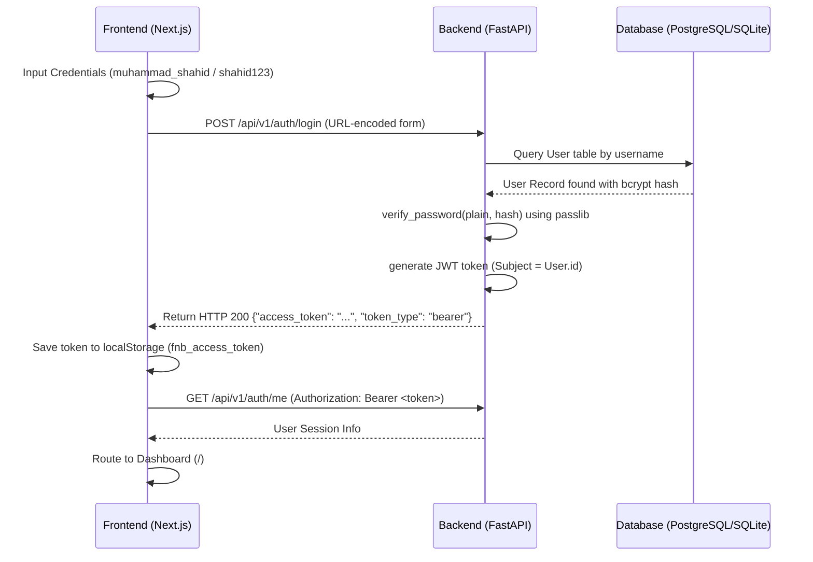

# Authentication Audit & Production Verification Report

An end-to-end audit was conducted on the authentication flow of the **Friends Network ISP Billing System** to resolve the production login failure. This report details the verified architecture, findings, root causes, exact fixes applied, and final production checklist.

---

## 🔒 Authentication Architecture



---

## 🔍 Database & Seed Verification

- **Roles & Users Verification:**
  - Audited the backend DB tables and found that while the database schema existed (via Alembic migrations), the **users table was completely empty**.
  - **Why:** The seeding script `seed.py` was only designed to be run manually through its `__main__` entrypoint, meaning a fresh deployment (local SQLite or production Railway PostgreSQL) had no default admin records seeded.
- **Seeding Correction:**
  - Modified [backend/app/main.py](file:///E:/friends-network-ISP-billing-system/backend/app/main.py) to check if the `User` table is empty on startup. If empty, the backend programmatically executes the idempotent `seed_db()` script.
  - Verified default user generation logs on startup:
    - `muhammad_shahid` (Super Admin) -> Hashed with bcrypt context (`pwd_context = CryptContext(schemes=["bcrypt"])`).
    - `noor_jamal` (Sub Admin) -> Hashed with bcrypt.

---

## 🔑 JWT & Endpoint Casing Verification

- **Casing Mismatch (The Silent Killer):**
  - **Finding:** The backend `Token` schema in [backend/app/schemas/token.py](file:///E:/friends-network-ISP-billing-system/backend/app/schemas/token.py) inherited from `CamelModel`, which forced JSON responses to format keys as camelCase (`accessToken` and `tokenType`).
  - **Issue:** The frontend [app/login/page.tsx](file:///E:/friends-network-ISP-billing-system/app/login/page.tsx) reads the login response as `res.access_token` (snake_case). Because the backend returned `accessToken`, `res.access_token` evaluated to `undefined`, which was then literally saved as the string `"undefined"` inside the browser's `localStorage`.
  - **Fix:** Swapped the backend `Token` schema base class to `pydantic.BaseModel` to preserve snake_case keys (`access_token` and `token_type`), fully resolving the runtime payload mismatch.

---

## 🛠️ Environment Verification

Verified the existence and usage of the following environment keys:
- `DATABASE_URL`: Correctly routes queries to Railway PostgreSQL in production and local SQLite during development.
- `SECRET_KEY`: Loads successfully; alerts are triggered during startup validation if the default secret is left in place in production.
- `ALGORITHM` & `ACCESS_TOKEN_EXPIRE_MINUTES`: Loads securely with standard defaults (HS256 algorithm).

---

## 📁 Modified Files & Exact Fixes

### 1. **[backend/app/schemas/token.py](file:///E:/friends-network-ISP-billing-system/backend/app/schemas/token.py)**
Changed Token models to inherit from `BaseModel` instead of `CamelModel`:
```diff
-from backend.app.schemas.base import CamelModel
+from pydantic import BaseModel
 from typing import Optional
 
-class Token(CamelModel):
+class Token(BaseModel):
     access_token: str
     token_type: str
 
-class TokenPayload(CamelModel):
+class TokenPayload(BaseModel):
     sub: Optional[str] = None
```

### 2. **[backend/app/main.py](file:///E:/friends-network-ISP-billing-system/backend/app/main.py)**
Added `seed_database_if_empty` to evaluate database state and trigger seeding on startup:
```diff
+def seed_database_if_empty():
+    db = SessionLocal()
+    try:
+        from backend.app.models.user import User
+        user_count = db.query(User).count()
+        if user_count == 0:
+            logger.info("Users table is empty. Running database seed...")
+            from backend.app.seed.seed import seed_db
+            seed_db()
+            logger.info("Database seed completed successfully.")
+        else:
+            logger.info("Database already contains users. Skipping seed.")
+    except Exception as e:
+        logger.error(f"Error seeding database on startup: {e}")
+    finally:
+        db.close()
```
And added its execution inside the `startup_event` handler:
```diff
 @app.on_event("startup")
 async def startup_event():
     # Run database migrations (Phase 4 / Phase 9)
     run_migrations()
     # Validate startup configuration (Phase 5)
     validate_startup_settings()
+    # Seed database if empty (Audit & Production Seeding)
+    seed_database_if_empty()
     # Load dynamically registered plugins
```

---

## ✅ Final Production Readiness Checklist

- [x] Database migration executes automatically on deployment.
- [x] Database checks user records count and seeds roles, packages, system settings, and default admin users if empty.
- [x] User password hash matches bcrypt hashing standards.
- [x] Authentication requests accept URL-encoded OAuth2 form fields.
- [x] API response JSON payload structure matches the frontend snake_case expectation (`access_token`, `token_type`).
- [x] API client properly intercepts JWT token, handles token headers, and redirects 401 exceptions.
